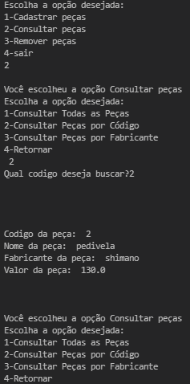

## Sistema de  Bicicletaria, atividade em python com conhecimentos basicos da linguagem.
### Cadastro de peças, filtragem do produto por codigo e fabricante, atividade com objetivo de aprender conceito basico de logica de programação em python, essa atividade foi solicitada na faculdade

